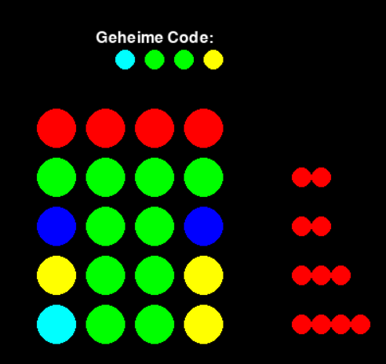
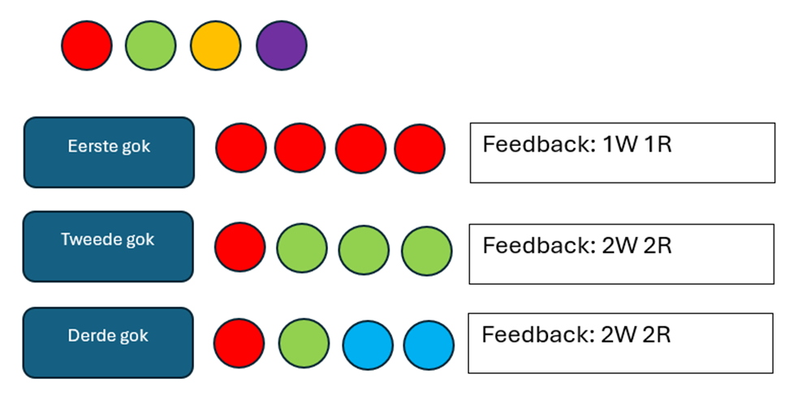

# Mastermind

## Doelstelling

Onze AI voor Mastermind streeft naar het zoeken van kleurcodes, met opties voor zowel willekeurige generatie als gebruikersinvoer. Het doel is om deze AI weer te geven met behulp van Pygame, en zo een interactieve en boeiende Mastermind-ervaring te bieden.

## Probleemstelling

Het ontwikkelen van een AI voor Mastermind presenteert verschillende uitdagingen. Een centrale kwestie is de strategie voor het vinden van de kleurcode. Moet de AI snel werken, efficiënt zijn, of een combinatie van beide? Deze keuze beïnvloedt direct de algehele prestaties en bruikbaarheid van de AI. Het afwegen van snelheid versus efficiëntie vereist diepgaand inzicht in de speelstijl en verwachtingen van de gebruikers.

Een ander belangrijk aspect is de keuze van de AI-tactiek. Moeten we vertrouwen op brute force methoden, waarbij alle mogelijke combinaties worden uitgeprobeerd? Of is een meer geavanceerde aanpak zoals min-max algoritmen passender? Misschien moeten we zelfs een volledig nieuwe benadering ontwikkelen die beter aansluit bij de complexiteit van het Mastermind-spel.

Het selecteren van de juiste strategieën en tactieken vereist een grondige analyse van de verschillende benaderingen, hun voor- en nadelen, en hun geschiktheid voor het specifieke doel van de AI. Bovendien moeten we rekening houden met factoren zoals geheugen- en rekenkrachtbeperkingen, aangezien deze de implementatie en prestaties van de AI kunnen beïnvloeden.

In essentie vraagt het maken van een AI voor Mastermind om een zorgvuldige afweging tussen snelheid, efficiëntie en complexiteit, waarbij de gekozen aanpak moet zorgen voor een gebalanceerde en effectieve oplossing voor het probleem.

## Analyse

Onze analyse van de probleemstelling en de voorbereidingen voor het project waren een grondig en methodisch proces, waarbij we zorgvuldig elke stap hebben doorlopen om een stevige basis te leggen voor de ontwikkeling van onze AI-agent voor het Mastermind-spel.

Om te beginnen hebben we de probleemdefinitie grondig onderzocht om een helder begrip te krijgen van de doelstellingen van ons project. We hebben vastgesteld dat ons voornaamste doel was om een AI-agent te ontwikkelen die in staat is om de geheime code in het Mastermind-spel te raden. Dit omvatte een diepgaande analyse van de spelregels, inclusief hoe de geheime code wordt gegenereerd en hoe de speler met het spel interageert.

Na het vaststellen van de probleemdefinitie zijn we overgegaan tot het verzamelen van de vereisten voor het project. Dit omvatte het identificeren van de gewenste functionaliteiten van de AI-agent en het bepalen van hoe deze zou moeten communiceren met de gebruiker. We hebben hierbij een intuïtieve gebruikersinterface ontworpen en de algoritmen en methoden vastgesteld die de AI-agent zou moeten gebruiken om effectief te kunnen spelen.

Een cruciaal onderdeel van onze analyse was het onderzoek naar de beschikbare gegevensbronnen. We hebben vastgesteld dat externe datasets niet nodig waren, omdat de geheime code intern wordt gegenereerd door het spel. Dit betekende dat we ons niet hoefden bezig te houden met het verzamelen of verwerken van grote hoeveelheden gegevens, waardoor de ontwikkelingstijd van het project werd verkort.

Vervolgens hebben we verschillende AI-algoritmen overwogen die geschikt zouden kunnen zijn voor het oplossen van ons probleem. Na zorgvuldige evaluatie hebben we besloten om een eenvoudige brute force methode te gebruiken, waarbij alle mogelijke combinaties van kleuren worden gegenereerd en geanalyseerd om de beste gok te bepalen. Deze methode werd gekozen vanwege haar eenvoud en effectiviteit bij het oplossen van het Mastermind-spel.

Een ander belangrijk aspect van onze analyse was het identificeren van de juiste tools en bibliotheken die nodig waren voor de ontwikkeling van het project. We hebben besloten om Pygame te gebruiken voor het maken van de game-omgeving, omdat het een krachtige en veelzijdige bibliotheek is voor het ontwikkelen van games in Python. Daarnaast hebben we gebruik gemaakt van de itertools-module voor het genereren van alle mogelijke combinaties van kleuren, wat ons hielp bij het implementeren van ons brute force algoritme.

Tot slot hebben we gekeken naar de implementatie en distributie van onze software. We hebben verschillende opties overwogen, waaronder het omzetten van de code in een uitvoerbaar bestand, het gebruik van Docker-containers voor betere isolatie, of het verpakken van de code als een Python-pakket dat kan worden geïnstalleerd via pip. Deze keuzes werden gemaakt op basis van de specifieke behoeften van het project en de voorkeuren van ons ontwikkelteam.

Door deze grondige analyse konden we een duidelijk en gestructureerd plan opstellen voor de ontwikkeling van onze AI-agent voor het Mastermind-spel, wat de basis vormde voor het succesvolle verloop van het project.

## Resultaat

#### Algemeen Overzicht:

Het Mastermind AI-project heeft geresulteerd in de ontwikkeling van een intelligente agent die in staat is om de geheime code in het Mastermind-spel te raden. De agent maakt gebruik van een eenvoudig brute force-algoritme in combinatie met een intuïtieve gebruikersinterface gemaakt met Pygame. Het resultaat van het project biedt een boeiende en interactieve ervaring voor gebruikers die willen spelen tegen een uitdagende AI-tegenstander.

#### Onderdelen van het Resultaat:

1. **Gebruikersinterface met Pygame:**

   - Beschrijving: De gebruikersinterface is ontwikkeld met behulp van de Pygame-bibliotheek, waardoor een interactieve en visueel aantrekkelijke spelomgeving is gecreëerd.
   - Uitwerking: De interface omvat een speelveld waar de speler zijn gokken kan invoeren en de ontvangen hints kan bekijken. Daarnaast zijn er kleurrijke knoppen beschikbaar voor het selecteren van kleuren voor gokken.

2. **Brute Force AI-algoritme:**

   - Beschrijving: Het AI-algoritme gebruikt een brute force-benadering om alle mogelijke combinaties van kleuren te genereren en te evalueren om de beste gok te bepalen.
   - Uitwerking: De AI-agent genereert systematisch alle mogelijke combinaties van kleuren en ontvangt feedback van het spel op basis van de hints die worden gegenereerd. Op basis hiervan past het algoritme zijn gokken aan en zoekt het naar de optimale strategie om de geheime code te raden.

3. **Feedbackmechanisme:**
   - Beschrijving: Het spel voorziet de AI-agent van hints na elke gok, wat de agent helpt bij het bepalen van de volgende zet.
   - Uitwerking: De hints worden gegenereerd op basis van de overeenkomsten tussen de gegokte code en de geheime code. Rode hints geven aan dat de kleur en de positie correct zijn, witte hints geven aan dat de kleur correct is maar de positie niet, en zwarte hints geven aan dat er geen overeenkomsten zijn.

#### Gedetailleerde Uitwerking van Onderdelen:

1. **Gebruikersinterface met Pygame:**

   - De Pygame-bibliotheek wordt gebruikt om de grafische gebruikersinterface van het spel te maken.
   - De interface omvat een speelveld waar de speler zijn gokken kan invoeren en een gebied waar de ontvangen hints worden weergegeven.
   - Kleurrijke knoppen worden weergegeven waarmee de speler kleuren kan selecteren voor zijn gokken.
     

2. **Brute Force AI-algoritme:**

   - Het brute force-algoritme begint met het genereren van alle mogelijke combinaties van kleuren.
   - Vervolgens wordt elke combinatie geëvalueerd door het spel te spelen en de ontvangen hints te analyseren.
   - Op basis van de hints past de agent zijn volgende gokken aan om zo snel mogelijk de geheime code te raden.

3. **Feedbackmechanisme:**
   - Het spel genereert hints na elke gok van de speler of de AI-agent.
   - De hints worden weergegeven als gekleurde pinnen, waarbij rood aangeeft dat de kleur en de positie correct zijn, wit aangeeft dat de kleur correct is maar de positie niet, en zwart aangeeft dat er geen overeenkomsten zijn.
   - Deze hints helpen de AI-agent bij het verfijnen van zijn strategie en het bepalen van zijn volgende zet.
     

Door deze gedetailleerde aanpak hebben we een interactieve en uitdagende spelomgeving gecreëerd waarin gebruikers kunnen spelen tegen een intelligente AI-tegenstander. Het Mastermind AI-project heeft niet alleen geleid tot een succesvolle implementatie van het spel, maar biedt ook inzicht in de ontwikkeling van AI-agents voor het oplossen van complexe puzzels.

## Uitbreiding

Het uitbreiden van een project waarbij een AI voor Mastermind wordt ontwikkeld, biedt talloze mogelijkheden om de functionaliteit en bruikbaarheid te verbeteren. Allereerst kunnen verschillende tactieken worden toegevoegd aan de AI, waardoor deze een breder scala aan strategieën kan toepassen bij het oplossen van kleurcodes. Dit omvat bijvoorbeeld het implementeren van brute force, min-max, en heuristische benaderingen, waardoor de AI zich kan aanpassen aan verschillende spelomstandigheden en niveaus van complexiteit.

Een andere waardevolle uitbreiding is het toevoegen van een functionaliteit waarmee gebruikers tegen de AI kunnen spelen. Dit biedt niet alleen een uitdagende speelervaring, maar stelt ook de AI bloot aan verschillende speelstijlen en niveaus van vaardigheid, waardoor deze zich verder kan ontwikkelen en verbeteren.

Bovendien kan de interactie met de gebruiker worden verbeterd door het implementeren van een meer intuïtieve en responsieve gebruikersinterface. Dit omvat het weergeven in hoeveel zetten de kleuren code is geraden geweest, een scoreboard die de beste scores bijhoud van in hoeveel zetten de code is gevonden.

Door deze uitbreidingen toe te passen, kan het project een meer dynamische en boeiende spelervaring bieden, waarbij zowel gebruikers als de AI worden uitgedaagd en gestimuleerd om hun vaardigheden te verbeteren.

## Conclusie

Na het voltooien van ons project voor het ontwikkelen van een AI voor Mastermind, kunnen we concluderen dat we een werkend en functioneel product hebben opgeleverd. De AI is in staat om kleurcodes op te lossen en biedt een uitdagende spelervaring voor gebruikers. Echter, bij het evalueren van ons werk realiseren we ons dat er ruimte is voor verbetering.

Tijdens de ontwikkeling van ons project hebben we een solide basis gelegd met geïmplementeerde strategieën. Echter, we beseffen dat er nog meer geavanceerde tactieken beschikbaar zijn die we hadden kunnen onderzoeken en integreren om de prestaties en veelzijdigheid van onze AI verder te verbeteren. Deze onbenutte mogelijkheden bieden interessante perspectieven voor toekomstige ontwikkeling en optimalisatie van het project.

Bovendien hebben we vastgesteld dat de interactie met de gebruiker, hoewel functioneel, nog verder verbeterd kan worden om een nog intuïtievere en boeiendere ervaring te bieden. Dit omvat het toevoegen van meer geavanceerde feedbackmechanismen en interactieve functies die de gebruikersbetrokkenheid vergroten.

Desondanks zijn we tevreden met de resultaten van ons project en zien we het als een solide basis voor toekomstige verbeteringen en uitbreidingen. Met deze conclusies in gedachten zijn we enthousiast om verder te gaan met het verfijnen en verbeteren van onze AI voor Mastermind, om zo een nog betere en bevredigende spelervaring te bieden aan onze gebruikers.

## Bibliografie

1. Python. (z.d.). Geraadpleegd op 10 maart 2024, van https://www.python.org/
2. Pygame. (z.d.). Geraadpleegd op 12 maart 2024, van https://www.pygame.org/
3. Pip. (z.d.). Geraadpleegd op 14 maart 2024, van https://pip.pypa.io/en/stable/
4. Mastermind (spel). (z.d.). Geraadpleegd op 8 maart 2024, van https://nl.wikipedia.org/wiki/Mastermind_(spel)
5. Kaggle. (z.d.). Geraadpleegd op 15 maart 2024, van https://www.kaggle.com/
6. Stack Overflow. (z.d.). Geraadpleegd op 13 maart 2024, van https://stackoverflow.com/
7. GitHub. (z.d.). Geraadpleegd op 14 maart 2024, van https://github.com/
8. ResearchGate. (z.d.). Geraadpleegd op 11 maart 2024, van https://www.researchgate.net/
9. Towards Data Science. (z.d.). Geraadpleegd op 9 maart 2024, van https://towardsdatascience.com/
10. ArXiv. (z.d.). Geraadpleegd op 7 maart 2024, van https://arxiv.org/
11. Nederlandse Pygame Community. (z.d.). Geraadpleegd op 12 maart 2024, van https://www.pygame.org/docs/
12. Chatgpt (ondersteuning met problemen)
